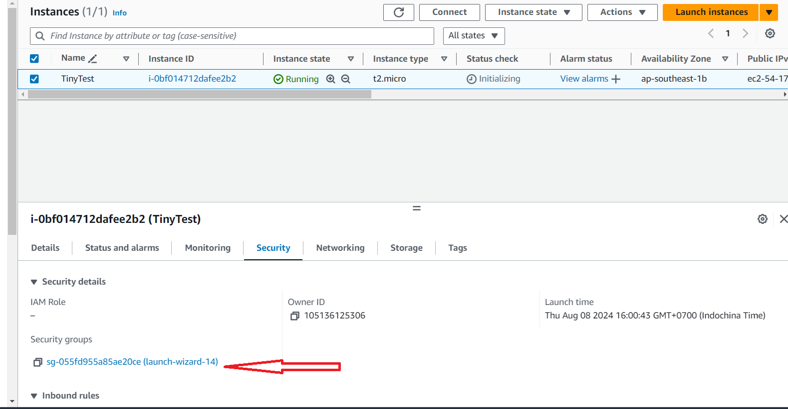

# Open Firewall on AWS

## Open Security Group

Select instance -> Security tab -> Click on security group

<figure><figcaption></figcaption></figure>

## Open a port

In security group click on Edit Inbound rules

<figure><figcaption></figcaption></figure>

Then click Add rule

<figure><figcaption></figcaption></figure>

Fill infomation and save

Type: Custom TCP\
Port: 3389 (or your selected port in tiny)\
Source Anywhere IPv4

<figure><figcaption></figcaption></figure>

Verify that you see the added rule

<figure><figcaption></figcaption></figure>
