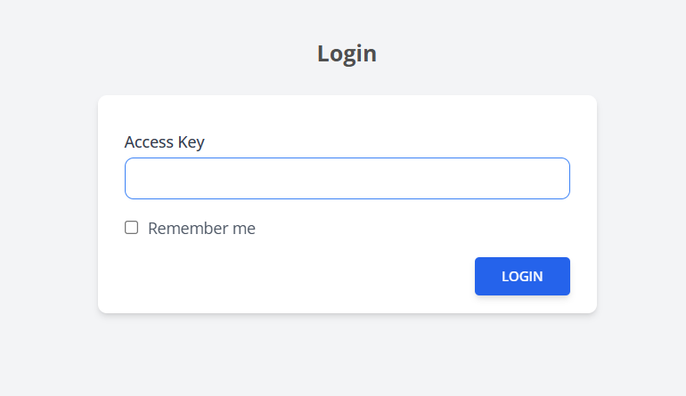

# Install Windows on Oracle Cloud

## Step 1 - Generate init script from TinyInstaller

To get started, you need an active **TinyInstaller access key.**

#### Login to TinyInstaller

Go to https://tinyinstaller.top/login then Enter your access key to continue.

<figure><figcaption>
Login
</figcaption></figure>

#### Get Init Script

Then select Os and check Init Script

<figure><figcaption>
Get Init script
</figcaption></figure>

## Step 2 - Create Windows VPS on Oracle Cloud with Init Script

### Create new VM Instance

Login to Oracle Cloud then click CREATE INSTANCE

<figure><figcaption></figcaption></figure>

### Choose Image and shape

Choose Ubuntu image, and AMD/Intel shape

<figure><figcaption></figcaption></figure>

### Set the initialization script

Scroll to bottom of page click on "Show advanced options" -> Management tab, then paste init script from TinyInstaller into Automation - Startup script

<figure><figcaption></figcaption></figure>

### Create VM

Finally click CREATE button to create VM

<figure><figcaption></figcaption></figure>

### Instance created

<figure><figcaption></figcaption></figure>

After instance created we go back to TinyInstaller -> My Instances to check install status

## Step 3 - Check install status

You can monitor install processes at [My Instances](https://tinyinstaller.top/my-instances)

<figure><figcaption></figcaption></figure>

You can view status detail by click the link on status column

<figure><figcaption></figcaption></figure>

## Step 4 - Access to Windows

When installation done, you can copy it and access to RDP

<figure><figcaption></figcaption></figure>

That's all, you now connect to windows via RDP. Everything is processed automatically.
