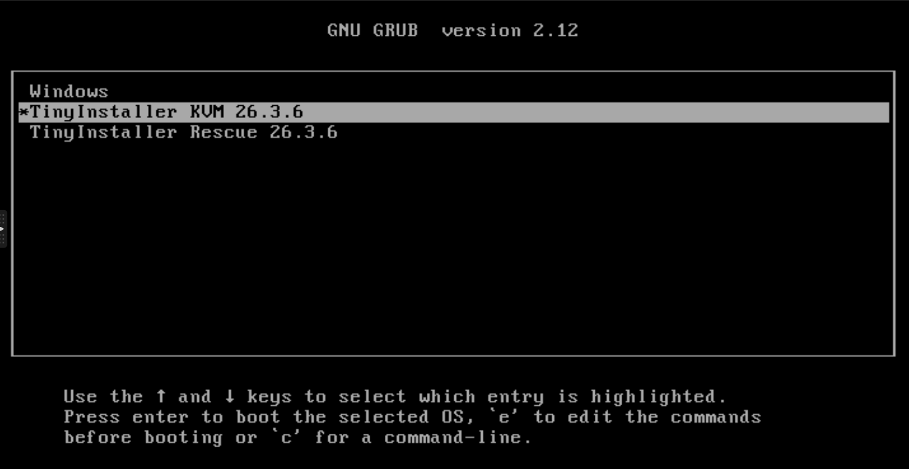

# Use on Dedicated/Baremetal

We don't guarantee support on baremetal, it may work or not work. We just try our best to provide 2 options to make it working on baremetal

1. Dedicated deployment profile

<figure><figcaption></figcaption></figure>

1. Run inside QEMU

<figure><figcaption></figcaption></figure>

For normal deployment profiles, it will default to boot into QEMU mode for best compability. But if you want to try direct mode, please select windows on grub menu
