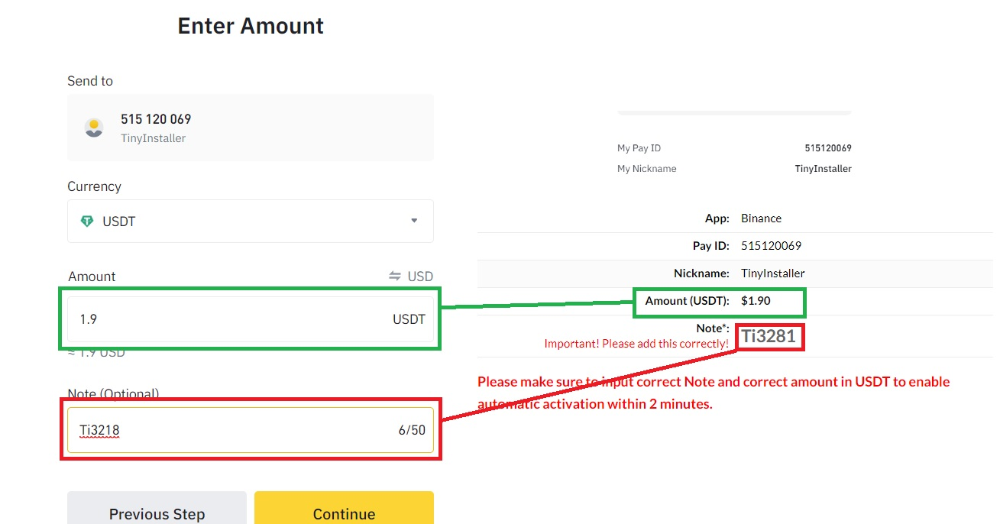
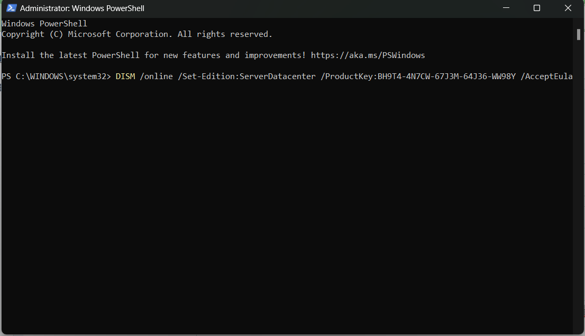

# Pay with Binance

It's very important to set the Note when pay with binance. Without valid note order cannot be confirmed.

## How to pay on web

<figure><figcaption></figcaption></figure>

## How to pay on mobile

1. Open Binance pay app
2. Scan Qr code on website
3. Tap on amount input amount
4. Tap on Add Note and input the note (should be in Ti+number format e.g. Ti1234)

<figure><figcaption>
Tap on "Add Note" to write the Note
</figcaption></figure>

 

<figure><figcaption>
Write the Note show on Tinyinstaller payment screen
</figcaption></figure>

